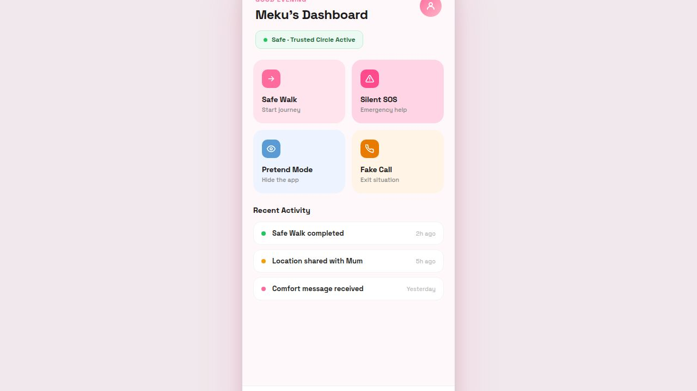
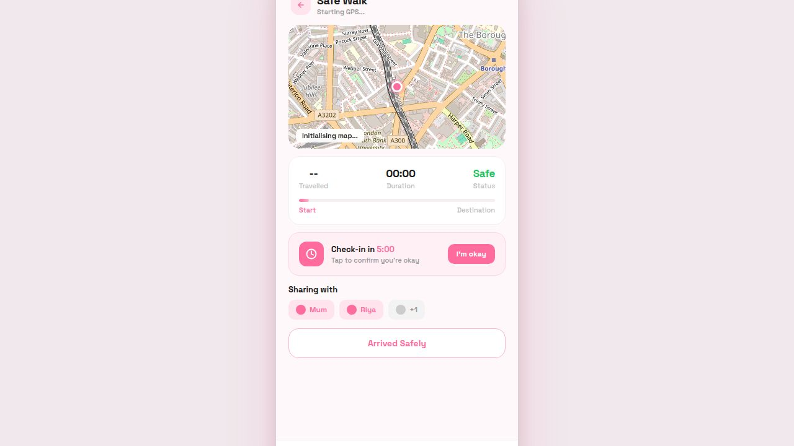
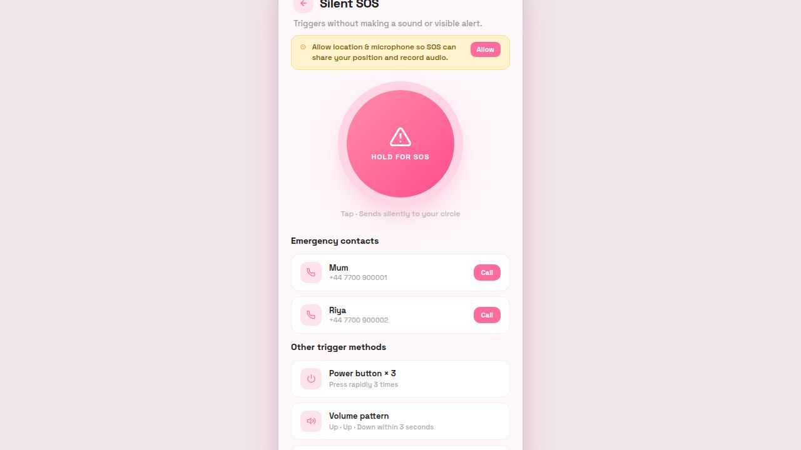
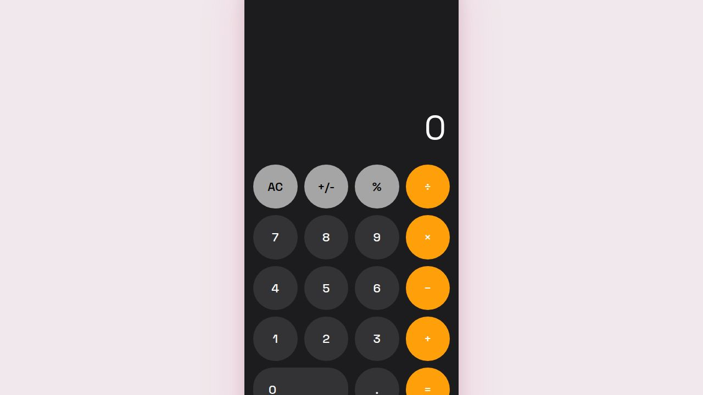

<div align="center">
  <h1>🛡️ SafMeh</h1>
  <p><strong>A personal safety companion — because your safety matters.</strong></p>
  <p>
    
    
    
    
    
  </p>
  <br/>
  <em>"Even when no one is physically there, someone still cares about your safety."</em>
</div>

---

## What is SafMeh?

SafMeh is a **mobile-first personal safety web app** that runs entirely in the browser — no install needed. It gives you real, working tools to stay safe when walking alone, travelling late, or in any uncomfortable situation.

Unlike heavy native apps, SafMeh loads instantly and works on any phone. Just open the link and it's ready.

---

## Screenshots

<table>
  <tr>
    <td align="center">
      
      <br/><strong>Dashboard</strong><br/>
      <sub>All features at a glance</sub>
    </td>
    <td align="center">
      
      <br/><strong>Safe Walk</strong><br/>
      <sub>Live GPS + route tracking</sub>
    </td>
    <td align="center">
      
      <br/><strong>Silent SOS</strong><br/>
      <sub>Emergency alerts + contacts</sub>
    </td>
    <td align="center">
      
      <br/><strong>Pretend Mode</strong><br/>
      <sub>Calculator disguise</sub>
    </td>
  </tr>
</table>

---

## Video Walkthrough

> 🎬 **To record a walkthrough:** Use your phone's built-in screen recorder (iOS: Control Centre → Screen Record · Android: Quick Settings → Screen Record), then open the app and walk through each feature below.

**Suggested recording flow (≈ 2 min):**

```
1. Open app → Dashboard — show the 4 feature cards and safe status pill
2. Tap Safe Walk → allow GPS → show live map dot + route drawing + check-in timer
3. Back → tap Silent SOS → tap the SOS button → show dark activated state + SMS/call links
4. Cancel SOS → tap Pretend Mode → show working calculator
5. Triple-tap top bar → app returns from calculator → tap Fake Call → show incoming call UI
```

---

## Features

### 🏠 Dashboard
Your home screen. Shows your safety status, Trusted Circle activity indicator, and quick-access cards for all four core features. Recent activity is listed so you can see what happened and when.

---

### 🚶 Safe Walk — Live GPS + Map Tracking

> Tap **Safe Walk** → allow location → walk safely

| What happens | How |
|---|---|
| Real-time GPS | `navigator.geolocation.watchPosition()` — updates every few seconds |
| Live map | Leaflet.js + OpenStreetMap tiles — your pink dot moves as you move |
| Route drawing | Each GPS point is connected — your path is drawn on the map |
| Distance tracking | Haversine formula calculates metres/km travelled in real time |
| Trip timer | Live MM:SS counter starts when you open the screen |
| Check-in countdown | 5-minute timer — tap **"I'm okay"** to reset it |
| Sharing | Shows contacts your location is shared with (Mum, Riya, +1) |
| End session | **"Arrived Safely"** clears all tracking and returns to dashboard |

**GPS flow:**
```
Allow location → watchPosition() starts → Leaflet map centres on you
→ Pink dot updates live → route path drawn → check-in timer counts down
→ "Arrived Safely" clears everything
```

---

### 🆘 Silent SOS — Emergency Alert System

> Tap **Silent SOS** → tap the big button → your circle is alerted silently

When triggered, SafMeh:

1. **Grabs your GPS coordinates** instantly
2. **Starts microphone recording** (browser `getUserMedia`)
3. **Pre-fills SMS messages** to emergency contacts — location + Google Maps link — one tap to send
4. **Shows direct call links** to each contact — one tap to call

**Pre-filled SOS message:**
```
SOS! I need help. My location: https://maps.google.com/?q=LAT,LNG — SafMeh
```

**Other trigger methods:**

| Method | How |
|---|---|
| Screen button | Tap the large pink SOS button |
| Power × 3 | Press power button rapidly 3 times |
| Volume pattern | Up · Up · Down within 3 seconds |
| Voice keyword | Say your secret phrase |

> **Note on SMS/calls:** Browser security requires one tap to send a message or call. The SMS and dialer open pre-filled — just tap send/call. Native apps can do this fully silently; a future native version of SafMeh will.

---

### 👁️ Pretend Mode — Calculator Disguise

> Tap **Pretend Mode** → app becomes a fully working calculator

If someone grabs your phone or checks what you're doing, Pretend Mode instantly disguises SafMeh as a standard iOS-style calculator. It's fully functional — you can actually do maths on it.

| Feature | Detail |
|---|---|
| Looks like | iOS Calculator (dark theme, orange operators) |
| Actually works | Full arithmetic — +, −, ×, ÷, %, +/- |
| Secret return | **Triple-tap the top bar** of the screen to go back to SafMeh |
| No trace | No indication the app is SafMeh |

---

### 📞 Fake Call — Exit Any Situation

> Tap **Fake Call** → realistic incoming call appears on screen

Creates a full-screen incoming call overlay — your excuse to leave any uncomfortable situation immediately.

| Feature | Detail |
|---|---|
| Caller name | Randomly chosen from: Mum, Riya, Priya, Best Friend, Work |
| Phone vibration | `navigator.vibrate()` pulses the phone |
| Answer | Starts a live call timer — looks like a real active call |
| Decline | Dismisses the overlay cleanly |

---

## Getting Started

### Run locally

```bash
# Clone the repo
git clone https://github.com/Anadi99/safmeh.git
cd safmeh

# No npm install needed — zero dependencies!
node server.js

# Open in your browser
open http://localhost:5000
```

### Best on mobile

1. Deploy to [Replit](https://replit.com), [Railway](https://railway.app), or [Render](https://render.com)
2. Open the URL on your phone
3. Browser menu → **"Add to Home Screen"** — works like a native app icon

---

## Customising Emergency Contacts

Open `server.js` and update the contacts in two places:

```js
// In the SOS screen HTML — update name + phone number
{ name: 'Mum',  tel: '+447700900001' },
{ name: 'Meku', tel: '+447700900002' },

// Fake call names (randomly selected)
const fakeCallers = ['Mum', 'Riya', 'Priya', 'Best Friend', 'Work'];
```

Replace with your actual emergency contacts.

---

## Permissions

| Permission | Used for | When asked |
|---|---|---|
| 📍 Location | GPS tracking in Safe Walk · SOS location capture | Opening Safe Walk or SOS |
| 🎙️ Microphone | Audio recording when SOS is triggered | On SOS activation |

Permissions are asked in context — never on first load.

---

## Tech Stack

| Layer | Technology |
|---|---|
| Server | Node.js built-in `http` — zero npm dependencies |
| Maps | [Leaflet.js](https://leafletjs.com/) + [OpenStreetMap](https://openstreetmap.org) |
| GPS | `navigator.geolocation.watchPosition()` |
| Microphone | `navigator.mediaDevices.getUserMedia()` |
| SMS / Calls | `sms:` and `tel:` URI schemes |
| Vibration | `navigator.vibrate()` Web API |
| Font | [Space Grotesk](https://fonts.google.com/specimen/Space+Grotesk) |
| Styling | Vanilla CSS — no framework, no build step |
| Routing | Single-page app, vanilla JS screen switching |

---

## Design System

| Token | Value | Used for |
|---|---|---|
| Primary pink | `#FF6B9D` | Buttons, icons, accents |
| Light pink | `#FFB6C8` | Backgrounds, SOS dark mode text |
| App background | `#FFF8FA` | Screen background |
| Safe green | `#22C55E` | Safe status, confirmed check-ins |
| SOS dark | `#0D0008` | Background when SOS is active |
| Font | Space Grotesk 400–700 | All text |

---

## Roadmap

- [ ] Real contact storage (save numbers in browser localStorage)
- [ ] Push notifications when check-in timer runs out
- [ ] WhatsApp deep-link for SOS messages
- [ ] Live location sharing with Trusted Circle (WebSockets)
- [ ] Voice keyword detection (Web Speech API)
- [ ] PWA manifest + offline support
- [ ] Native app (Flutter) for fully silent SOS

---

## Original Flutter Version

This repository also contains the original **Flutter app** design and architecture (in the `lib/` folder) with:
- BLoC/Cubit state management
- 9 feature cubits (auth, SOS, safe walk, fake call, pretend mode, etc.)
- 177 unit tests
- Full Firebase-ready architecture (swap mock → real by replacing one class)

The web version (`server.js`) is a fully functional implementation of the same features that runs without any native install.

---

## About

SafMeh was built for anyone who has ever felt unsafe walking alone, travelling at night, or being in an uncomfortable situation. It quietly says:

> *"I care about your safety, even when I'm not there."*

---

<div align="center">
  <sub>Built with care · SafMeh · Open Source · MIT License</sub>
</div>
